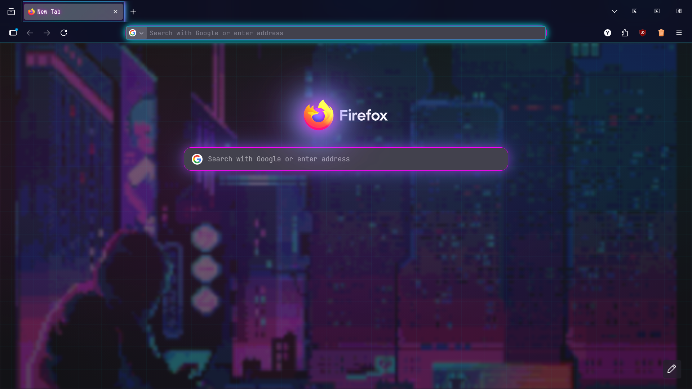

[](https://github.com/yok1rai)

# ⚡ CYBERPUNK NEXUS - Firefox Theme

<p align="center">
   
</p>


A futuristic, neon-drenched Firefox theme that transforms your browser into a cyberpunk-inspired interface with animated backgrounds and holographic glass effects.

## 📋 Prerequisites

### Required Firefox Settings:
1. **Enable userChrome.css**:
   - Go to `about:config`
   - Search for `toolkit.legacyUserProfileCustomizations.stylesheets`
   - Set to `true`

## 🛠 Installation

### Method 1: Manual Profile Installation (Recommended)
1. **Find Your Profile Folder**:
   - Go to `about:profiles`
   - Click "Open Directory" next to your active profile

2. **Copy Theme Files**:
   - Copy the entire `chrome` folder from this repository
   - Paste it into your Firefox profile directory
   - Your structure should look like:
   ```
   your-profile/
   └── chrome/
       ├── userChrome.css
       ├── userContent.css
       ├── fonts.css
       └── images/
           └── cyberpunk.gif
   ```

3. **Restart Firefox** completely to apply the theme

### Method 2: Temporary Load (Development)
1. Go to `about:debugging`
2. Click "This Firefox"
3. Click "Load Temporary Add-on"
4. Select the `manifest.json` file from the `metadata` folder

## 🎯 Theme Features

### 🎨 Visual Design:
- **Animated Pixel Skyline** background with cyberpunk cityscape
- **Neon Color Palette** (cyan, pink, purple, green, yellow)
- **Holographic Glass UI** with backdrop blur effects
- **JetBrains Mono Font** throughout the interface
- **Glowing Borders** and multi-layer shadow effects

### ⚡ Interface Enhancements:
- **Glass Morphism Toolbars** with transparency
- **Animated URL Bar** with pulse effects
- **Cyberpunk New Tab** page with neural network aesthetics
- **Custom Scrollbars** with gradient neon thumbs
- **Themed Context Menus** with glass effects

## 📁 Repository Structure
```
main/
├── chrome/
│   ├── userChrome.css          # Browser UI styling
│   ├── userContent.css         # New tab page styling
│   ├── fonts.css              # JetBrains Mono font definitions
│   └── images/
│       └── cyberpunk.gif      # Animated background
├── metadata/
│   └── manifest.json          # Theme manifest file
├── preview/
│   ├── image1.png            # Theme preview screenshots
│   └── image2.png
├── LICENSE
└── README.md
```

## 🎮 Customization

### Changing Colors:
Modify the CSS variables in `chrome/userChrome.css`:
```css
:root {
    --neon-pink: #ff00ff;      /* Change to your preferred neon color */
    --neon-cyan: #00ffff;
    --bg-deep: #050510;        /* Change background darkness */
}
```

### Adjusting Transparency:
```css
:root {
    --bg-glass: rgba(13, 15, 26, 0.75);  /* 0.75 = opacity level */
    --glass-blur: blur(25px) saturate(200%);
}
```

## 🔧 Troubleshooting

### Common Issues:

1. **Theme not applying?**
   - Verify `toolkit.legacyUserProfileCustomizations.stylesheets` is set to `true`
   - Check all files are in profile/chrome directory
   - Restart Firefox completely

2. **Fonts not loading?**
   - Ensure JetBrains Mono is installed on your system
   - Check font file paths in `fonts.css`

3. **Images not displaying?**
   - Verify `cyberpunk.gif` is in the correct images folder
   - Check image paths in CSS files

4. **Performance issues?**
   - Reduce blur effects: change `blur(25px)` to `blur(15px)`
   - Disable some animations in the CSS

## ⚡ Quick Tips
- Use `Ctrl+Shift+J` to open Browser Console for CSS debugging
- Back up your profile before making changes
- Disable other themes to avoid conflicts
- Check `preview/` folder for theme screenshots

## 🔗 Resources
- [Firefox CSS Documentation](https://firefox-source-docs.mozilla.org/toolkit/content/toolkit/themes/)
- [userChrome.org](https://www.userchrome.org/)

---

**Enjoy your cyberpunk browsing experience!** 🦾🌃
